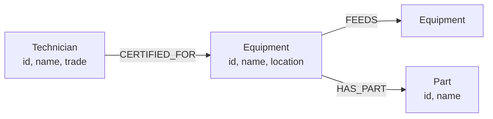

# Failtrace

Trace how a single equipment failure spreads through an industrial plant.

Pick a machine and Failtrace tells you what else stops running, how many steps away each affected machine is, which spare parts it uses, and who is certified to work on it. It also ranks every machine in the plant by how much damage its failure would cause.

Built for the Wexa AI CognoDB take-home assignment.

**Live demo:** _<add your Vercel URL here>_
**Screen recording:** _<add your link here>_

---

## The problem

In a plant, machines supply things to other machines. A generator supplies the distribution board, which powers the air compressor, which feeds the air dryer, which supplies compressed air to the filling machine, the capper, the case packer and the paint booth.

When one machine goes down, everything downstream of it goes down too — and the chain can run seven or eight machines deep. Maintenance teams need to know three things quickly:

1. If this machine fails, what stops?
2. Which machines are the most dangerous to lose?
3. Which spare parts, if they run out, take down more than one machine?

None of these are answerable by reading a list of connections. All three are traversal questions.

## Why a graph database?

The interesting questions here are about **paths of unknown length**, and that is precisely where a relational schema struggles.

**Recursive depth.** "What stops if the generator fails?" is not a single join. The generator feeds the distribution board, which feeds six machines, which feed others, which feed others. You don't know before asking whether the chain is one step or eight. In SQL this is a recursive CTE that grows more expensive and more awkward with every level. In Cypher it is a single variable-length pattern:

```cypher
MATCH (:Equipment {id: $id})-[:FEEDS*1..10]->(downstream:Equipment)
```

**Multiple paths to the same node.** The capping machine is reachable both along the packaging line and through the compressed-air branch, because it needs bottles arriving _and_ air to grip caps. Any honest answer must count it once, at its shortest distance. `min(length(path))` and `count(DISTINCT …)` handle this natively; in SQL it means deduplicating rows across a recursive union.

**Aggregating over traversals.** The criticality ranking runs the traversal from every machine and sorts by how many each one reaches. Expressing "for each row, follow an arbitrary-length path and count the distinct endpoints" in SQL is possible but genuinely unpleasant. In Cypher it is four lines.

**Collecting neighbours alongside a count.** The shared-parts query returns both how many machines use a part _and_ which machines they are, in one pass. SQL would group to get the count, then join back to the source table to recover the names.

**What a relational schema would still do fine:** storing the machines, the parts, and the direct connections. The data itself is not the argument. The argument is that every question worth asking about it is a traversal, and traversal is what the query language is for.

## Data model

Three node labels, three relationship types.



| Relationship    | From → To              | Meaning                                                                                        | Traversal                                      |
| --------------- | ---------------------- | ---------------------------------------------------------------------------------------------- | ---------------------------------------------- |
| `FEEDS`         | Equipment → Equipment  | Supplies power, compressed air, cooling water or steam. If the source stops, the target stops. | Variable-length — this is the one that matters |
| `HAS_PART`      | Equipment → Part       | A component fitted to this machine. Parts are **types**, so several machines can share one.    | Single hop                                     |
| `CERTIFIED_FOR` | Technician → Equipment | Permitted to work on this machine.                                                             | Single hop                                     |

Two modelling decisions worth naming:

**`FEEDS` is directional and its direction carries the meaning.** Reversing an edge inverts the answer. Utilities (air lines, cooling circuits) are modelled as Equipment rather than a separate label, since they behave identically for traversal purposes and a fourth label would add nothing.

**Parts are types, not instances.** A `V-Belt A42` node is fitted to the compressor, the conveyor and the cooling tower. Modelling each part as unique to its machine would make the shared-parts query return nothing, and would lose the stocking insight the query exists to produce.

The seeded plant is a **directed acyclic graph** — nothing feeds back into its own supply. That is what makes unbounded traversal safe here. Traversals are nonetheless capped at 10 hops (`MAX_DEPTH` in `lib/queries.ts`), above the longest real chain of 7, to protect the free-tier instance from a pathological query if the data ever changes.

### Seeded data

15 machines across 5 locations · 20 `FEEDS` connections · 20 parts · 36 `HAS_PART` links · 6 technicians · 18 certifications.

Deliberately small. The free CognoDB instance is 0.5 vCPU and 256 MB, and a dataset you can read end to end is easier to verify against than a generated one.

## The main queries

All Cypher lives in `lib/queries.ts`. Every value is passed as a driver parameter — there is no string-concatenated Cypher anywhere in the project.

### 1. Blast radius — multi-hop traversal

```cypher
MATCH path = (:Equipment {id: $id})-[:FEEDS*1..10]->(d:Equipment)
WITH d, min(length(path)) AS hops
RETURN d.id AS id, d.name AS name, d.location AS location, hops
ORDER BY hops, d.name
```

`*1..10` follows `FEEDS` between one and ten hops. `min(length(path))` collapses the multiple routes that can reach the same machine down to its shortest distance, so each affected machine appears once with an honest hop count.

### 2. Criticality ranking — aggregation over traversals

```cypher
MATCH (e:Equipment)
OPTIONAL MATCH (e)-[:FEEDS*1..10]->(d:Equipment)
WITH e, count(DISTINCT d) AS impact
RETURN e.id AS id, e.name AS name, e.location AS location, impact
ORDER BY impact DESC, e.name
```

`OPTIONAL MATCH` is load-bearing. Machines at the end of a line have no outgoing `FEEDS`, and a plain `MATCH` would drop them from the results entirely rather than scoring them zero. `DISTINCT` prevents double-counting machines reachable by more than one route.

In the seeded plant the generator scores 14 — it reaches every other machine — which correctly identifies it as the plant's single point of failure.

### 3. Shared parts — the awkward-in-SQL one

```cypher
MATCH (e:Equipment)-[:HAS_PART]->(p:Part)
WITH p, collect(e.name) AS machines
WHERE size(machines) > 1
RETURN p.id AS id, p.name AS name, machines, size(machines) AS machineCount
ORDER BY machineCount DESC, p.name
```

Returns the aggregate and the individual grouped values together in one result row. The machine names are the point — a bearing fitted to four machines across three utility branches is a stocking priority, and the count alone wouldn't tell you that.

### 4. Certified technicians and fitted parts

Single-hop lookups from the selected machine, used to populate the detail panel.

## Architecture

```
app/
  page.tsx                    single screen; owns selection state and data fetching
  layout.tsx
  api/
    equipment/route.ts        list all machines
    equipment/[id]/route.ts   one machine: blast radius, parts, technicians
    feeds/route.ts            all FEEDS edges, for the graph view
    criticality/route.ts      ranking
    shared-parts/route.ts     parts fitted to more than one machine
components/
  EquipmentList.tsx           sidebar, grouped by location
  EquipmentDetail.tsx         presentational — takes data as props, cannot fail
  GraphPanel.tsx              force-directed DAG view of the plant
  CriticalityTable.tsx
  SharedParts.tsx
  states/                     Loading, Empty, ErrorState
lib/
  db.ts                       driver singleton + environment validation
  queries.ts                  all Cypher, one function per query
  useApi.ts                   fetch hook with a discriminated-union state
types/index.ts
scripts/
  data.ts                     the plant definition
  seed.ts                     loads it into CognoDB
```

**Layering.** Components call API routes, API routes call `lib/queries.ts`, and `lib/queries.ts` calls the driver from `lib/db.ts`. No Cypher exists outside `queries.ts`, and no component knows the database exists.

**Connection handling.** `lib/db.ts` creates one driver at module scope and returns the same instance on every call. The driver owns a connection pool, so creating one per request would exhaust the free tier's 200-connection limit. The pool is capped at 10 per instance, well under that ceiling even with several concurrent serverless instances.

This is the one real tension in the stack choice. Bolt is a persistent TCP protocol and serverless functions are ephemeral, so an always-on Node process would suit it more naturally. Next.js was chosen anyway for the single deployment target and because server-side route handlers keep the database password structurally out of the browser rather than by convention; the singleton and the pool cap are the mitigation.

**Error handling.** Route handlers return `503` when the database is unreachable and `404` for a machine that doesn't exist — two different situations the UI presents differently. Driver errors are logged server-side and never sent to the client, which would leak connection details. `useApi` models state as a discriminated union rather than loose booleans, so it is not possible to render data while loading is still true.

## Setup

### Prerequisites

Node 20+ and pnpm.

### 1. Create a CognoDB instance

1. Sign up at [console.cognodb.com/signup](https://console.cognodb.com/signup) — the free tier needs no card.
2. Create a free `c0` instance and pick a region. It provisions in under a minute.
3. Copy the connection URI (`bolt+s://<instance-id>.databases.cognodb.cloud`) and the generated password. **The password is shown once** — save it immediately.

### 2. Configure and install

```bash
git clone <repo-url>
cd failtrace
pnpm install
cp .env.example .env
```

Fill in `.env`:

```
COGNODB_URI=bolt+s://<instance-id>.databases.cognodb.cloud
COGNODB_USER=cognodb
COGNODB_PASSWORD=<your password>
```

`.env` is gitignored and never committed.

### 3. Seed the database

```bash
pnpm tsx scripts/seed.ts
```

Expected output:

```
Seeded:
  Equipment: 15
  Part: 20
  Technician: 6
```

The script clears the database first, so it is safe to re-run.

### 4. Run

```bash
pnpm dev
```

Open [http://localhost:3000](http://localhost:3000).

### Deploying

Import the repository into Vercel and set `COGNODB_URI`, `COGNODB_USER` and `COGNODB_PASSWORD` as environment variables. No build configuration is needed.

## Screenshots

_<add screenshots of the main screen, the graph view, and the criticality ranking>_

## Stack

Next.js (App Router) · TypeScript · Tailwind CSS · `neo4j-driver` over Bolt · `react-force-graph-2d` · CognoDB · Vercel

CognoDB speaks openCypher over Bolt and works with the official Neo4j drivers, so no custom SDK is involved.

## With more time

**Write path.** A form to add equipment and connections, so the plant can be edited without re-seeding. The Cypher is a `MERGE` rather than a `CREATE`, so submitting twice is idempotent. This is first on the list because adding a machine visibly changes the criticality ranking and every blast radius that touches it — which demonstrates the traversal is computed live rather than baked into the seed data.

**Redundancy modelling.** `FEEDS` currently means "if this stops, that stops." Real plants have standby paths — a backup generator, a duplicate pump. Modelling that would mean a property on the relationship (`redundant: true`) and a traversal that only propagates failure when _every_ incoming supply is down. That is a genuinely harder graph problem than the current one, and the most interesting extension here.

**Cost of downtime.** Adding an hourly production value to each machine turns the criticality ranking from a count into a currency figure, which is the form a maintenance budget actually needs.

**Precomputed criticality.** The ranking traverses from all 15 nodes on every request. That is fine at this size and would not be at ten thousand. It would become a periodic job writing an `impact` property onto each node, with the live query kept as the source of truth.

**Path explanation.** The app reports that the case packer stops when the compressor fails, but not why. Returning the path itself — compressor → dryer → capper → labeller → packer — would make each answer self-explaining.

**Tests.** The traversal queries have exact expected answers against the seed data: the generator reaches 14, the air compressor reaches 6, the capper is 2 hops from the dryer. That makes them straightforward to assert against a test instance.

## Known limitations

- Read-only. Editing the plant means changing `scripts/data.ts` and re-seeding.
- Traversal depth is capped at 10. Above a few thousand machines the criticality query should be precomputed and cached rather than run live, since it traverses from every node on each request.
- The graph view renders all 15 machines at once. At significantly larger scale it would need to render a neighbourhood around the selection rather than the whole plant.
